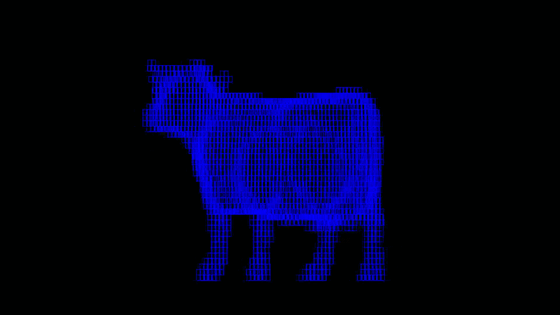

# Voxelizer in Java :D


## Penjelasan Singkat Program

Program ini mengubah object 3D dalam format file ```.obj``` menjadi bentuk voxel-voxel yang berukuran seragam.
Menghasilkan file dengan format yang sama (```.obj```) dan memberikan statistic dari prosesnya juga.

## Requirement Program

- [Java Development Kit (JDK) 21 or newer](https://www.oracle.com/asean/java/technologies/downloads/)
- [Apache Maven 3.6 or newer](https://maven.apache.org/install.html)
- JavaFX 21


## Compiling & Running

Jalankan perintah berikut di terminal pada direktori root proyek I.E. ```/Tucil2_13524050_13524072/```:

```bash
mvn clean compile
```

Setelah dikompilasi, jalankan program dengan perintah:

```bash
mvn javafx:run
```
2 Window akan terbuka, 1 untuk converter dan 1 untuk 3D viewer

## Cara Menggunakan Converter

1. Pilih file ```.obj``` dengan mengklik tombol ```Choose .obj file```
2. Ketik depth dari Tree yang diinginkan
3. Ketik nama dari file outputnya
4. Klik ```Build octree```

## Cara Menggunakan 3D Viewer

1. Load file ```.obj``` dengan mengklik tombol ```Choose .obj```
2. Gunakan WASD untuk mengontrol kamera
   - W : zoom in
   - S : zoom out
   - A : turn clock-wise
   - D : turn counter clock-wise

## Author
Raysha Erviandika Putra | 13524050\
I Gusti Ngurah Alit Dharma Yudha | 13524072
